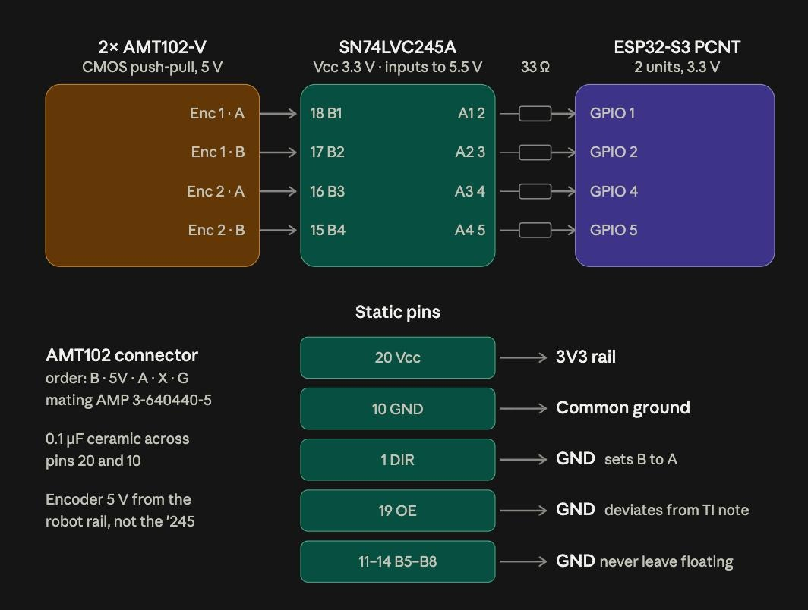
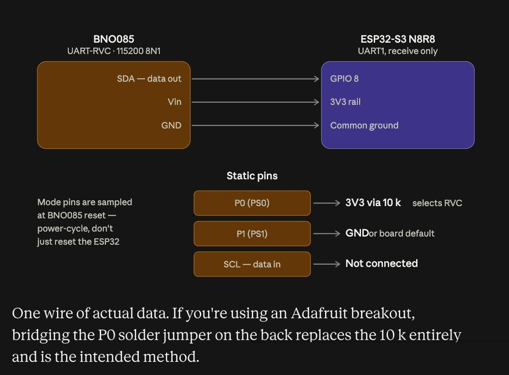
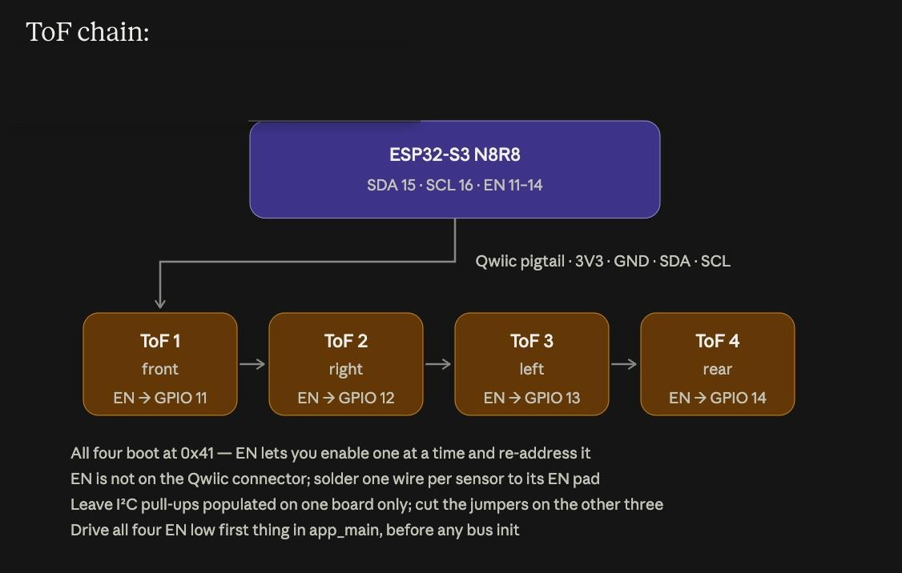
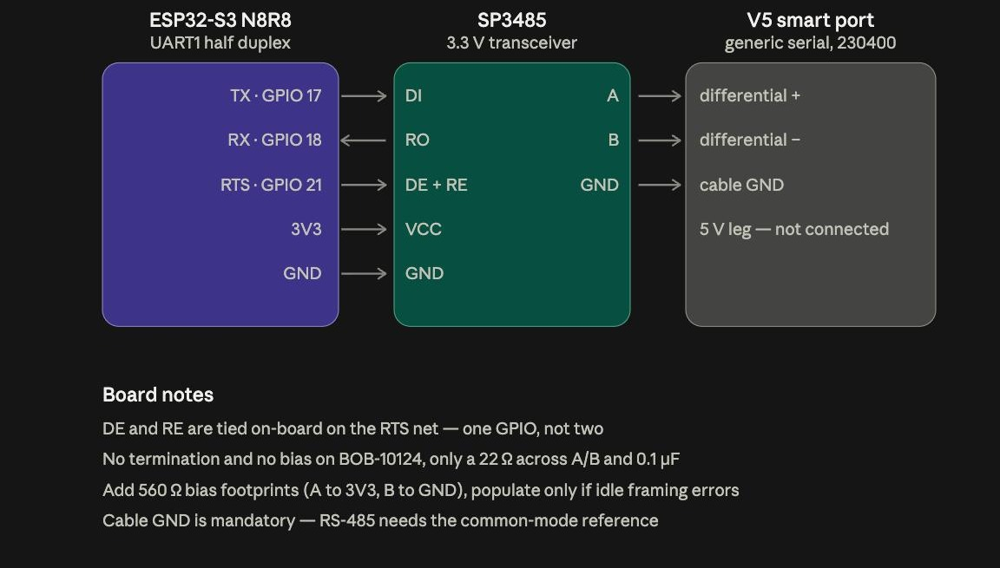

# What We Built on the Breadboard

When the parts arrived, we wired every component from section 1 onto a breadboard and flashed one firmware image to the ESP32-S3.

## What it does

The firmware reads the two AMT102-V encoders (through the level converter), the BNO085 IMU, and the four TMF8821 ToF sensors. It runs a 300-particle Monte Carlo localization filter and sends the resulting pose to the V5 brain over RS-485 every 10 ms (100 Hz). The brain replies with its status, and the pod uses that reply to measure round-trip time and to stop trusting ToF readings while the robot is driving hard. The pod drives nothing. It only reports pose.

Everything runs in a single task, and the firmware prints its own timing, link and per-sensor diagnostics about once a second. A separate bench test (`tools/tof_test`) brings up the four ToF sensors one stage at a time and streams live distances, so each can be checked on its own.

## Pin map (breadboard, V1)

| Function | Signal | GPIO |
|---|---|---|
| Vertical encoder | A | 1 |
| Vertical encoder | B | 2 |
| Horizontal encoder | A | 3 |
| Horizontal encoder | B | 4 |
| IMU (BNO085, UART-RVC) | RX | 8 |
| RS-485 | TX (DI) | 17 |
| RS-485 | RX (RO) | 18 |
| RS-485 | DE + RE (tied) | 21 |
| ToF I²C (all 4 sensors) | SDA | 16 |
| ToF I²C (all 4 sensors) | SCL | 15 |
| ToF enable | Front | 11 |
| ToF enable | Right | 12 |
| ToF enable | Rear | 14 |
| ToF enable | Left | 13 |
| Console UART | TX / RX | 43 / 44 (921600 baud) |

Notes on the wiring:
- The encoders' 5 V outputs go through the SN74LVC245A level converter to reach 3.3 V logic.
- The SP3485 RS-485 transceiver has DE and RE tied together and driven as the UART's RTS pin, so the hardware handles the send/receive turnaround.
- The BNO085 is receive-only. Its P0 jumper must be bridged to select UART-RVC mode, otherwise it starts in I²C mode and the RX pin stays silent.
- The four ToF sensors share one I²C bus. They all boot at address `0x41`, so each has its own enable pin and is moved to `0x42` (front), `0x43` (right), `0x44` (rear) or `0x45` (left) one at a time at boot.
- The ToF enable pins are in harness order, not numeric order.
- GPIO 0/45/46, 19/20, 26-37 and 48 are not used on this module (strapping, USB, flash, PSRAM and the on-board LED).

## Circuit diagrams

The breadboard was wired from these four diagrams.

### Encoders

The 5 V encoder outputs go through the SN74LVC245A to 3.3 V logic, with a 33 Ω resistor in each line. The encoders get their 5 V from the robot rail, not from the level converter. The unused B5-B8 inputs are tied to ground, and OE is tied low.

### IMU

One data wire from the BNO085 to GPIO 8, plus power and ground. P0 selects RVC mode, so it is tied to 3.3 V, or bridged with the solder jumper on the back of the Adafruit breakout. The mode pins are only read at reset, so the BNO085 has to be power-cycled, not just the ESP32.

### ToF sensors

Four TMF8821s on one Qwiic chain, each with its own enable wire (front, right, left, rear on GPIO 11, 12, 13, 14). All four boot at `0x41`, so they are enabled one at a time and given new addresses. The enable pin is not on the Qwiic connector, so one wire is soldered to each sensor's EN pad. I²C pull-ups are left on for one board only.

### RS-485 link

The ESP32's UART drives an SP3485 transceiver, which connects to the V5 smart port's two differential lines. The 5 V line on the smart port is not connected, but the cable ground is, because RS-485 needs the common reference.

**Check against the pin table.** The encoder and ToF I²C pins in these diagrams differ from the pin table above, which comes from the flashed code. The diagrams show the horizontal encoder on GPIO 4/5 (the table has 3/4), and SDA/SCL on GPIO 15/16 (the table has 16/15).

## Key settings

| Setting | Value |
|---|---|
| Encoder resolution | 8192 counts per revolution (AMT102-V at 2048 PPR, all four edges counted) |
| Encoder glitch filter | 1 µs |
| Pod mounting | Diamond, 45° |
| IMU link | 115200 baud, 19-byte frames |
| Loop rate | 10 ms (100 Hz) |
| ToF I²C speed | 100 kHz to set up, 400 kHz to run |
| ToF ranging | 70 ms period, staggered 17 ms between sensors, custom 4-zone map |
| Particle filter | 300 particles |
| Pose report | 56 bytes from the pod, 23-byte status reply from the brain |

## The code we flashed

| What | Where |
|---|---|
| Firmware | [`ODOM-CODE` at `5a9fc94`](https://github.com/albinjoby82-ops/ODOM-CODE/tree/5a9fc94) |
| Same code, original repo | [`gaelforce_esp32`](https://github.com/ronanhawkins/gaelforce_esp32), Ronan's `main` (`f138950`) plus the ToF fix and bench test (`5a9fc94`, from PR #1) |
| Pin numbers | `include/pod_config.hpp` (V1 pins, not the PCB's) |
| Main loop | `src/main.cpp` |
| ToF bring-up and filtering | `src/tof_array.cpp` |
| ToF bench test | `tools/tof_test/` |

Build with PlatformIO (ESP-IDF) for the ESP32-S3-DevKitC-1 with the N8R8 module. The shared `gflib` library (odometry, particle filter, link protocol) is not in either repo.

## How it differs from section 1

Section 1 is the design intent. The breadboard build runs as one task at 100 Hz rather than the two-core split, leaves PSRAM off, and gives the filter one median distance per ToF sensor rather than a distance-and-angle pair.
