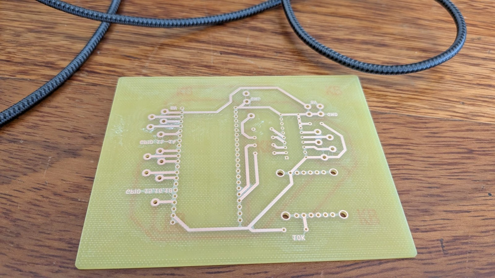
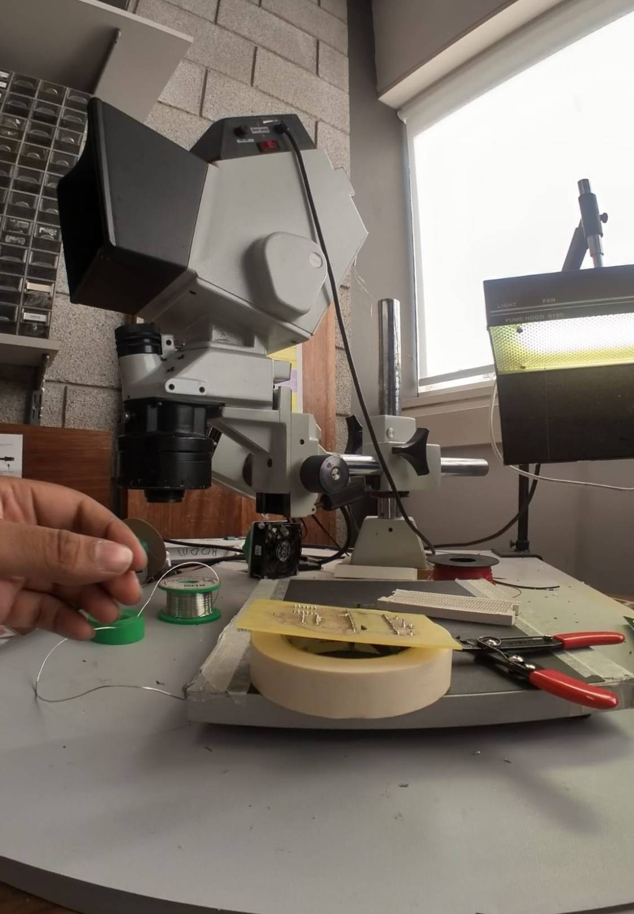
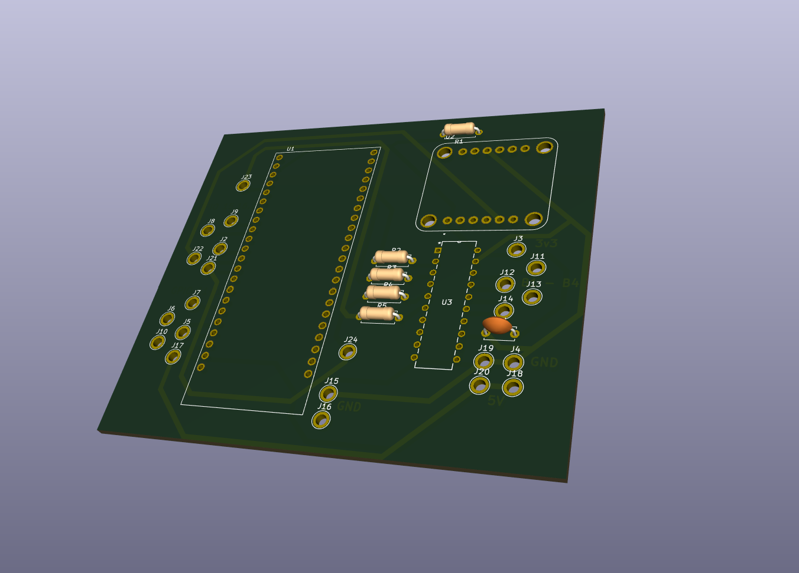
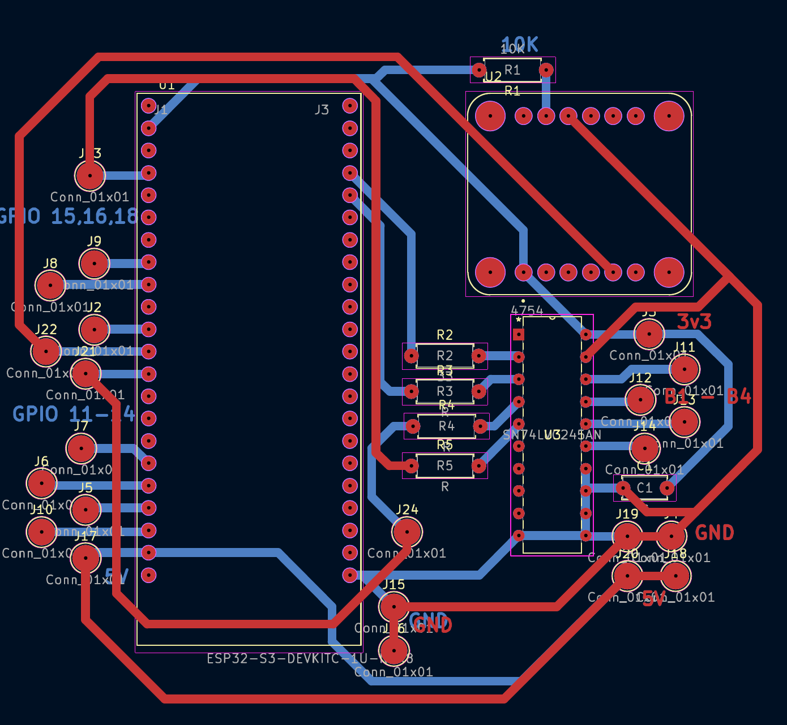
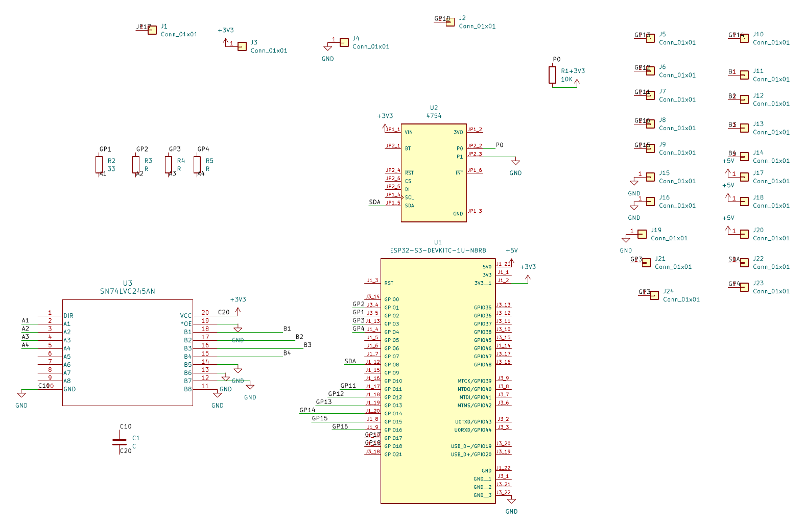

# PCB V1

## The idea

The breadboard worked, so the first PCB was a direct copy of it: the same schematic, the same parts and the same connections, laid out on a board. The schematic and the PCB were designed in KiCad, the board was made in the Elecworkshop, and the parts were soldered on.

The bare V1 board, copper side.

Soldering the V1 board.

## What went wrong

On a breadboard, any signal can go to any pin, because you just plug in a jumper wire. On a PCB that freedom is gone, and the wiring that matters is the wiring that leaves the board. Both encoders and all four ToF sensors connect to the pod by cables, so every one of those cables had to leave the board somewhere.

The pin assignments came straight from the breadboard, where they had been chosen for convenience, so on the PCB they ended up scattered across the ESP32's headers. The cables coming off the board for the encoders and the ToF sensors were a tangled mess.

Copying the breadboard exactly turned out not to be the right way to get a PCB. A good PCB layout starts from where the connectors and cables go, and picks the pins to suit.

## What worked

The board worked. The ToF sensors and the rest of the pod ran the V1 firmware. There was one layout mistake: the IMU's ground was put on the wrong layer.

## The V1 firmware

The V1 firmware is Ronan's `gaelforce_esp32` at commit [`f138950`](https://github.com/albinjoby82-ops/ODOM-CODE/tree/f138950) (Sep 30, "pin changes"). A copy is in this repo at [`code/pcb-v1/`](../code/pcb-v1/). It differs from the breadboard firmware in the pin numbers only. Two signals moved: the horizontal encoder from GPIO 4/5 to GPIO 3/4, and the ToF I²C pins from SDA/SCL 15/16 to 16/15.

| Function | Signal | GPIO |
|---|---|---|
| Vertical encoder | A / B | 1 / 2 |
| Horizontal encoder | A / B | 3 / 4 |
| IMU (BNO085) | RX | 8 |
| RS-485 | TX / RX / DE+RE | 17 / 18 / 21 |
| ToF I²C | SDA / SCL | 16 / 15 |
| ToF enable | Front / Right / Rear / Left | 11 / 12 / 14 / 13 |

## What it taught us

The problem was never the parts or the schematic. It was the pin layout. That led to V2, which starts from where the cables leave the board and groups the pins to match.

## Design files

A 3D render of the V1 board from KiCad. The ESP32-S3 dev board sits on the left, the IMU breakout at the top right, and the level converter and the four series resistors in the middle. The single-pin connectors are scattered around the edges and the corners.

The V1 board layout, from the KiCad PCB editor. Front copper is red and back copper is blue. The traces fan out from the ESP32-S3's pins to the single-pin connectors around the edges. Click the image for the PDF.

The V1 schematic. It has the ESP32-S3 dev board, the level converter with series resistors on the four encoder lines, the IMU breakout, and a single-pin connector for each off-board wire. Click the image for the PDF.

- [Schematic (PDF)](../hardware/v1/ODOM-V1-schematic.pdf)
- [PCB layout (PDF)](../hardware/v1/ODOM-V1-pcb-layout.pdf)
- [Gerbers and drill files](../hardware/v1/gerbers.zip), as sent to the board maker.
- [KiCad project folder](../hardware/v1/): the schematic, project file and custom symbol and footprint libraries.
