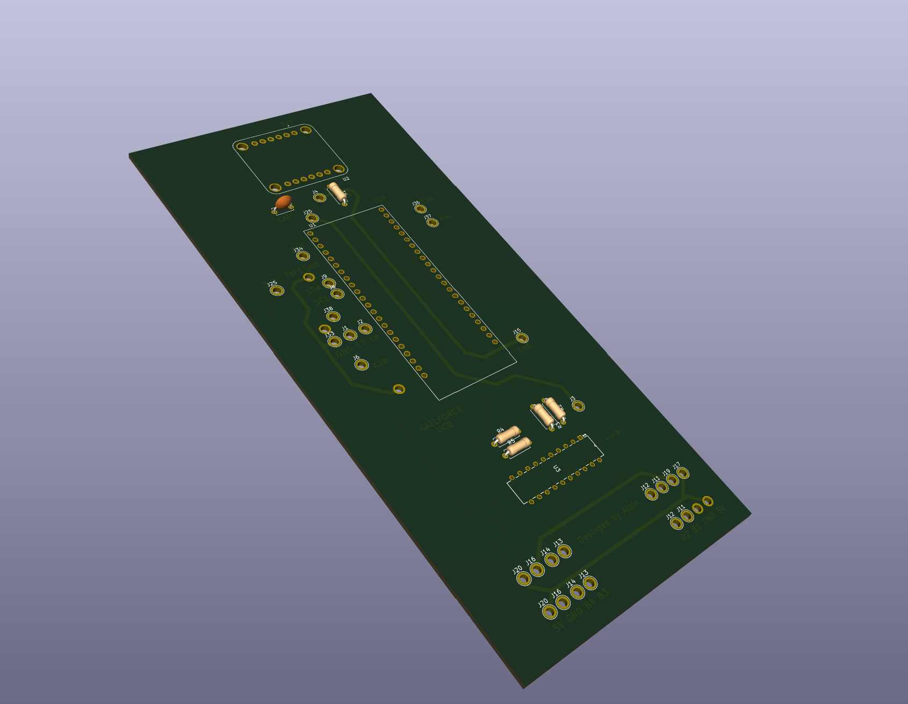
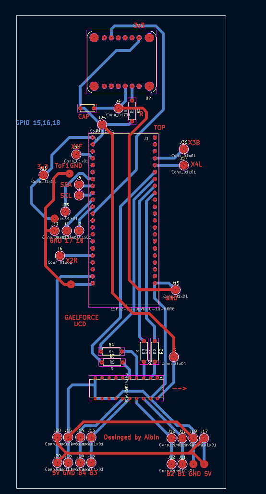
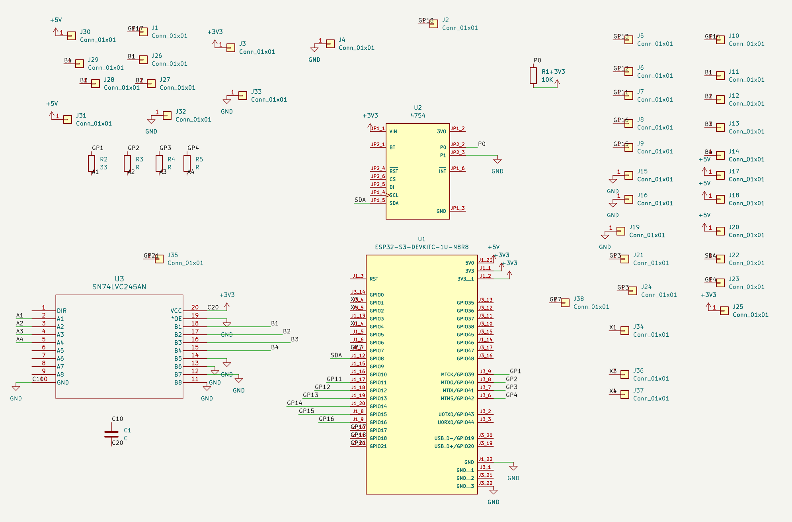

# PCB V2

V2 fixes what went wrong with V1. It has three changes: a fixed IMU ground, a much smaller board, and a pin map that follows where the cables leave the board.

## What changed

**The IMU ground.** On V1, the ground trace for the IMU was on the top layer when it should have been on the bottom. V2 has it on the bottom layer.

**The size.** V2 is about 60% smaller than V1. On V1 the copper was routed over the top of the ESP32, which took a lot of board. On V2 it is routed underneath the ESP32 instead.

**The pins.** V1 kept the breadboard's pin numbers, which left the encoder and ToF cables scattered around the board. V2 regroups the pins so each set of cables leaves from one place. Eight pins moved. Everything else is the same.

| Signal | V1 GPIO | V2 GPIO | Why |
|---|---|---|---|
| Vertical encoder A | 1 | **40** | Encoders grouped on four adjacent header pins |
| Vertical encoder B | 2 | **42** | |
| Horizontal encoder A | 3 | **39** | |
| Horizontal encoder B | 4 | **41** | |
| ToF enable, front | 11 | **4** | Uses a pin the encoders freed up |
| ToF enable, rear | 14 | **1** | Uses a pin the encoders freed up |
| ToF enable, left | 13 | **2** | Uses a pin the encoders freed up |
| RS-485 DE/RE | 21 | **7** | Nearest free pin that is not a strapping pin |

These stay the same: the IMU receive pin on GPIO 8, RS-485 TX and RX on 17 and 18, I²C SDA and SCL on 16 and 15, and the right ToF enable on 12.

The level converter's B pins are also wired to make the cabling easier. B1 and B2 carry the encoders' B channels, and B3 and B4 carry their A channels. If an encoder counts backwards, the firmware has a reverse flag for each one, so the wiring does not need to change.

The full write-up of every move, with the reason for each, is in [`PIN_CHANGES.md`](../code/pcb-v2/PIN_CHANGES.md), and the V2 wiring tables are in the [firmware README](../code/pcb-v2/README.md).

## The V2 firmware

The V2 firmware is the V1 firmware with the new pin numbers in `include/pod_config.hpp`, plus the later ToF mask-order fix and bench test. It is in [`code/pcb-v2/`](../code/pcb-v2/), at commit `986a2f3` of `ODOM-CODE`.

V1 and V2 firmware are not interchangeable. GPIO 1, 2 and 4 were encoder inputs on V1 and are ToF enable outputs on V2, so flashing the wrong firmware drives the wrong wire. Flash V2 firmware only on a V2 board.

## Status

V2 has been sent to the Elecworkshop to be made. It has not been built or tested yet, so there are no results here.

## Design files

A 3D render of the V2 board from KiCad. The board is long and narrow. The IMU breakout is at the top, the ESP32-S3 is in the middle, and the four resistors and the level converter are below it. The ESP32-S3 and the IMU show only as outlines, because their 3D models are not in the project.

The V2 board layout, from the KiCad PCB editor. Front copper is red and back copper is blue. Most of the back copper runs under the ESP32-S3 and ends at connector groups at the bottom of the board. Click the image for the PDF.

The V2 schematic. It has the ESP32-S3 dev board, the IMU breakout, the level converter and four resistors, and a single-pin connector for each off-board wire. Click the image for the PDF.

- [Schematic (PDF)](../hardware/v2/ODOM-V2-schematic.pdf)
- [PCB layout (PDF)](../hardware/v2/ODOM-V2-pcb-layout.pdf)
- [Gerbers and drill files](../hardware/v2/gerbers.zip), as sent to the board maker. The [job file](../hardware/v2/ODOM%20V2-job.gbrjob) is next to it.
- [KiCad project folder](../hardware/v2/): the schematic, board file, project file and custom symbol and footprint libraries.